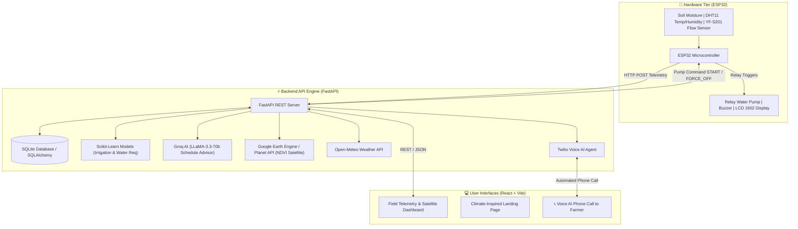

# 🌾 AgriMate: Agentic AI-Based Explainable Precision Farming System

[](https://fastapi.tiangolo.com/)
[](https://reactjs.org/)
[](https://python.org)
[](https://www.espressif.com/)
[](https://scikit-learn.org/)
[](https://groq.com/)
[](https://earthengine.google.com/)
[](../LICENSE)

**AgriMate** is an end-to-end, multi-source precision agriculture and irrigation platform that combines real-time IoT sensor telemetry (MQTT/HTTP), machine learning predictions, satellite crop health monitoring (Sentinel-2 NDVI via Google Earth Engine), Agentic AI decision reasoning (REASON → PLAN → DECIDE), Explainable AI (XAI) transparent factors, live weather forecasting, farmer feedback loops, and automated Twilio Voice AI agents for farmers.

---

## 🌟 Key Features

- 🛰️ **Satellite Crop Health Monitoring**: Computes real-time **NDVI (Normalized Difference Vegetation Index)** from Sentinel-2 satellite imagery at 10m spatial resolution with interactive Leaflet map overlays.
- 🧠 **Dual Machine Learning Engines**:
  - **Irrigation Binary Classifier**: Predicts whether field irrigation is required ($Yes / No$) with confidence scores.
  - **Water Requirement Regressor**: Calculates exact recommended water volume (in millimeters or Liters) based on soil moisture, crop type, growth stage, and weather.
- ⚡ **Groq AI (`llama-3.3-70b-versatile`) Schedule Advisor**: Generates 7-day adaptive irrigation plans with date-stamped recommendations, risk evaluations (drought vs waterlogging), and human-understandable explanations for ML decisions.
- 🔌 **ESP32 Hardware Telemetry & Automation**: Real-time sensor reading (Soil Moisture, DHT11 Temperature & Humidity, YF-S201 Water Flow pulse meters), LCD display output, and automated relay water pump triggers (`START`, `FORCE_OFF`, `STAY_OFF`).
- 📞 **Twilio Voice AI Phone Agent**: Interactive automated voice calls to farmers providing daily voice advisories and collecting voice responses in local languages.
- 🌦️ **Live Weather Integration**: Real-time 7-day rainfall forecasting and evapotranspiration data powered by Open-Meteo API.
- 💻 **Modern Web Application & Landing Page**: React + Vite dashboard for real-time field monitoring, alongside a responsive climate-inspired landing page built with Tailwind CSS and Shadcn UI.

---

## 🏗️ System Architecture



---

## 📁 Repository Directory Structure

```text
.
├── README.md
└── iot/
    ├── backend/                          # FastAPI REST API & AI Engine
    │   ├── app/
    │   │   ├── api/                      # API Endpoints (Sensors, Satellite, Voice, Schedule, Farmers)
    │   │   ├── services/                 # Business logic (Groq AI, Satellite, Weather, ML Prediction, Twilio)
    │   │   ├── models/                   # SQLAlchemy DB Models
    │   │   └── main.py                   # FastAPI Application Entrypoint
    │   ├── requirements.txt              # Python Dependencies
    │   └── test_*.py                     # Complete Test Suite (Satellite, Schedule, Models, Voice)
    │
    ├── frontend/                         # React + Vite Web Applications
    │   ├── src/                          # Main Telemetry & Satellite Dashboard
    │   ├── climate-inspired-landing/     # Climate-Inspired Marketing & Landing Portal
    │   ├── package.json
    │   └── vite.config.js
    │
    ├── hardware/                         # ESP32 Microcontroller Firmware
    │   └── esp32_firmware.ino            # Arduino C++ Sketch for ESP32 & Sensors
    │
    └── ml_model/                         # Machine Learning Pipeline
        ├── saved_models/                 # Serialized Pickle Models (.pkl)
        ├── train.py                      # Base Model Training Script
        └── train_comprehensive.py        # Advanced Dual-Model Training Script
```

---

## 🚀 Quick Start Guide

### Prerequisites

- **Python**: 3.10 or higher
- **Node.js**: v18.0 or higher
- **C++ IDE**: Arduino IDE or VS Code with PlatformIO (for ESP32 hardware deployment)

---

### 1. Backend Setup (FastAPI)

```bash
# Navigate to backend directory
cd iot/backend

# Create virtual environment
python -m venv venv

# Activate virtual environment
# On Windows:
venv\Scripts\activate
# On Linux/macOS:
source venv/bin/activate

# Install dependencies
pip install -r requirements.txt

# Start the FastAPI server
python -m uvicorn app.main:app --reload --host 0.0.0.0 --port 8000
```

> 🌐 **API Documentation**: Once running, access the interactive Swagger docs at `http://localhost:8000/docs` or ReDoc at `http://localhost:8000/redoc`.

---

### 2. Frontend Setup (React + Vite)

#### Main Dashboard:
```bash
# Navigate to frontend directory
cd iot/frontend

# Install dependencies
npm install

# Start development server
npm run dev
```

#### Landing Page:
```bash
cd iot/frontend/climate-inspired-landing
npm install
npm run dev
```

---

### 3. Hardware Setup (ESP32 Microcontroller)

1. Open `iot/hardware/esp32_firmware.ino` in Arduino IDE or PlatformIO.
2. Install required libraries: `WiFi`, `HTTPClient`, `DHT sensor library`, `LiquidCrystal_I2C`.
3. Configure your WiFi credentials and local FastAPI backend IP:
   ```cpp
   const char* ssid = "YOUR_WIFI_SSID";
   const char* password = "YOUR_WIFI_PASSWORD";
   const char* serverUrl = "http://YOUR_BACKEND_IP:8000/api/v1/sensors/data";
   ```
4. Flash the code to your ESP32 board.

---

## ⚙️ Environment Variables Configuration

Create a `.env` file inside `iot/backend/` based on the following template:

```env
# AI Engine Configuration
GROQ_API_KEY=your_groq_api_key_here
GROQ_MODEL=llama-3.3-70b-versatile

# Twilio Voice Service (Optional for Voice Calls)
TWILIO_ACCOUNT_SID=your_twilio_account_sid
TWILIO_AUTH_TOKEN=your_twilio_auth_token
TWILIO_PHONE_NUMBER=+1234567890

# Database & Security
DATABASE_URL=sqlite:///./irrigation.db
JWT_SECRET=super-secret-iot-key-123
ACCESS_TOKEN_EXPIRE_MINUTES=1440

# Base URL for Webhooks & Live Server
BASE_URL=http://localhost:8000
```

---

## 🔌 Hardware Circuit & Pinout Mapping

| Component | ESP32 Pin | Description |
| :--- | :--- | :--- |
| **Soil Moisture Sensor** | `GPIO 34` (Analog) | Reads soil moisture levels (0-100%) |
| **DHT11 Temp & Humidity** | `GPIO 26` (Digital) | Ambient temperature and humidity sensor |
| **YF-S201 Water Flow Sensor** | `GPIO 27` (Interrupt) | Pulse counter measuring water flow rate (L/min) |
| **5V Relay Module (Water Pump)** | `GPIO 25` (Digital Output)| Controls 12V/220V solenoid or water pump switch |
| **Buzzer Alarm** | `GPIO 33` (Digital Output)| Auditory alarm for pump failure or leaks |
| **LCD 1602 (I2C)** | `SDA (GPIO 21) / SCL (GPIO 22)` | Displays real-time moisture, temp, & pump status |

---

## 📡 Core API Endpoints

### 🗓️ AI Irrigation Schedule
- `POST /api/v1/schedule/weekly-plan`: Generates a 7-day adaptive irrigation calendar using Groq AI (`llama-3.3-70b-versatile`).
- `POST /api/v1/schedule/model-explanation`: Returns natural-language reasoning behind ML decisions.
- `POST /api/v1/schedule/daily-recommendation`: Fetches today's precise irrigation guidance.

### 🛰️ Satellite & Crop Health
- `GET /api/v1/satellite/ndvi/{field_id}`: Retrieves current Sentinel-2 satellite NDVI index score.
- `GET /api/v1/satellite/crop-health/{field_id}`: Returns crop health categorization (Poor / Moderate / Healthy / Optimal) and AI recommendations.
- `POST /api/v1/satellite/refresh/{field_id}`: Forces satellite data sync from Google Earth Engine.

### 🔌 Sensors & Hardware
- `POST /api/v1/sensors/data`: ESP32 telemetry endpoint for receiving moisture, temperature, humidity, and flow rate readings.
- `POST /api/v1/sensors/predict`: Runs ML models against real-time sensor data.

---

## 🧪 Testing

Run the automated system verification test suite from `iot/backend`:

```bash
cd iot/backend

# Test Machine Learning Predictions
python test_models.py

# Test Groq AI Schedule Advisor
python test_schedule_advisor.py

# Test Satellite System & NDVI Parsing
python test_satellite_system.py

# Test End-to-End System Flow
python test_complete_system.py
```

---

## 📜 License

This project is licensed under the [MIT License](LICENSE).
